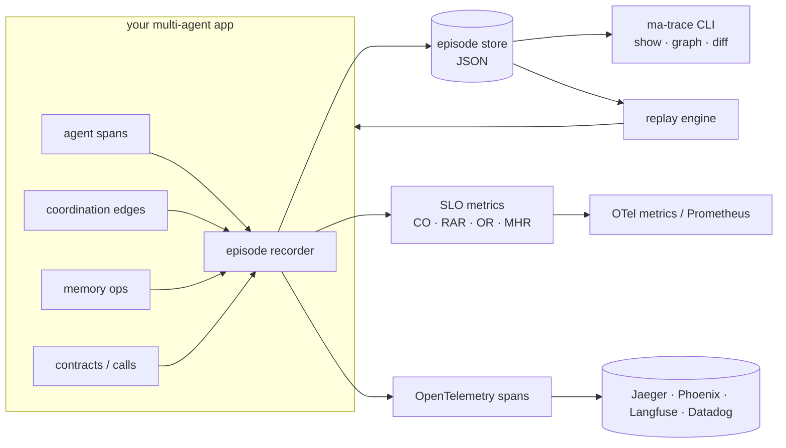

# multi-agent-observability

**MA-Trace - causal tracing, coordination SLOs and deterministic replay for multi-agent LLM systems - exported through OpenTelemetry.**

[](https://github.com/nunar-nexus-forge/multi-agent-observability/actions/workflows/ci.yml)
[](https://pypi.org/project/multi-agent-observability/)
[](pyproject.toml)
[](LICENSE)

"My agents did something weird and I can't reproduce it."

`multi-agent-observability` is an open-source implementation of **MA-Trace**, an observability
framework for multi-agent LLM systems. It adds three things that single-agent LLM tracing
tools and generic distributed tracing do not give you:

| What | Why it matters |
|---|---|
| **Coordination graphs** - every agent-to-agent message is a typed, timestamped, confidence-scored edge | see delegation chains, negotiation loops, bottleneck agents and cycles instead of a flat list of spans |
| **Memory operation traces** - reads, writes and evictions on episodic/semantic memory, with hit/miss, confidence and *eviction reason* | diagnose retrieval bias, stale reads and memory thrashing |
| **Environment contracts + deterministic replay** - seed-controlled pre/post-state hashes for every action, and recorded LLM/tool outputs | `ma-trace replay <episode>` re-executes a run **without calling the model** and tells you exactly where it diverged |

On top of that it computes three **multi-agent SLOs** (coordination overhead, redundant
action rate, oscillation rate) plus the memory hit ratio, exports everything as
OpenTelemetry spans and metrics (Jaeger, Phoenix, Langfuse, Datadog, Prometheus ...),
and ships adapters for **LangGraph / LangChain, CrewAI and AutoGen**.

It is additive: it plugs into the observability stack you already run.

---

## Install

```bash
pip install multi-agent-observability                     # core (OpenTelemetry API + SDK only)
pip install 'multi-agent-observability[langgraph]'        # + LangGraph / LangChain adapter
pip install 'multi-agent-observability[otlp,prometheus]'  # + OTLP exporter, Prometheus gauges
pip install 'multi-agent-observability[all]'
```

Python 3.10+. No API keys are needed for anything in this README; the examples use
seeded fake models.

> **Naming:** the distribution is `multi-agent-observability`; the framework itself is called
> MA-Trace, so the import is `import ma_trace as mt` and the CLI is `ma-trace <command>`.

## 60-second tour

```python
import ma_trace as mt

mt.configure("checkout-bot", exporter="console")  # optional: OTel export (console / otlp / SpanExporter)


@mt.llm("planner", provider="openai", model="gpt-4o")  # the wrapped call is recorded for replay
def ask(prompt: str) -> str:
    return client.chat(prompt)  # your code, unchanged


@mt.tool("search")
def search(query: str) -> list[str]:
    return backend.search(query)


def run(order_id: str):
    state = {"order": order_id, "charged": False}
    with mt.agent_span("planner"):
        plan = ask(f"plan the checkout of {order_id}")
        mt.coordination("planner", "executor", plan, kind="delegation", confidence=0.9)

    with mt.agent_span("executor"):
        mt.memory("executor", "read", "episodic", f"order:{order_id}", hit=False)
        with mt.contract("executor", "charge", pre_state=state) as c:  # seed-controlled contract
            state = charge(state, seed=c.seed)
            c.set_post_state(state)
        mt.action("executor", "charge", {"order": order_id})  # feeds the redundancy SLO


with mt.episode("checkout", seed=42, entrypoint="myapp:run", entrypoint_args={"order_id": "A1"}) as ep:
    run("A1")

print(ep.metrics().format())  # CO / RAR / OR / MHR for this episode
print(ep.coordination_graph().to_mermaid())
```

Later, when episode `ep-20260927-…` misbehaves:

```bash
ma-trace list                      # what was recorded (default store: ./.ma-trace/episodes)
ma-trace show latest --events      # timeline: agents, edges, memory ops, contracts, calls
ma-trace graph latest --format dot # coordination graph for Graphviz (or mermaid / json)
ma-trace metrics latest            # SLOs + threshold check (exit 1 with --fail-on-violation)
ma-trace replay latest             # deterministic re-execution: recorded LLM/tool outputs, verified contracts
ma-trace diff <ep-a> <ep-b>        # why did two runs differ?
```

`ma-trace replay` prints a report like:

```
replay of ep-20260927-141502-a3f1c2 -> ep-20260927-141530-9b0e77: DETERMINISTIC
  entrypoint        : myapp:run
  calls replayed    : 7  (executed live: 0)
  contracts checked : 4  (passed: 4)
  coordination_overhead: recorded=0.310 replayed=0.302
```

or, when the code path changed, a list of divergences (`input_mismatch`, `unexpected_call`,
`missing_call`, `contract_post_mismatch`, ...), each naming the agent and call.

Try it now with the bundled demo (no dependencies beyond `multi-agent-observability`):

```bash
python examples/basic_two_agents.py
```

To replay that episode from the CLI, work from the `examples/` directory: `ma-trace replay`
imports the recorded entrypoint module from the current working directory, and the store is
`./.ma-trace/episodes` relative to where the demo ran.

```bash
cd examples && python basic_two_agents.py && ma-trace list && ma-trace replay latest
```

## Concepts

### Episodes

An **episode** is one run of your workflow (`with mt.episode(name, seed=...)`). Everything
recorded inside - agent invocations, coordination edges, memory operations, contracts,
LLM/tool calls, actions and state snapshots - is stored as an ordered event log, persisted
as one JSON document, and mapped to an OpenTelemetry `invoke_workflow` span.

Seeding an episode seeds Python's `random` module and provides `episode.rng`; contracts
derive per-action seeds from it, so a replay sees the same sequence of seeds.

### Coordination graph  `G = (A, E)`

Each `mt.coordination(source, target, message, kind, confidence)` call is a directed edge
`(source, target, message, confidence, timestamp)`. Kinds: `message`, `delegation`,
`negotiation`, `consensus`, `response`, `broadcast`, `handoff`.
`episode.coordination_graph()` gives you degrees, bottlenecks, cycle detection,
delegation depth and DOT / Mermaid / JSON export.

### Memory operations  `m = (agent, op, type, key, confidence, t)`

`mt.memory(agent, op, memory_type, key, hit=..., confidence=..., eviction_reason=...)`, or
wrap any dict-like store in `TracedMemory` to record automatically (with capacity-based
eviction). `episode.memory_trace()` reports hit ratio, eviction reasons, thrashing keys and
low-confidence reads.

### Environment contracts  `Contract(a) = (s_pre, s_post, seed, result)`

```python
with mt.contract("executor", "move", pre_state=state) as c:
    state = env.step(action, seed=c.seed)
    c.set_post_state(state)
    c.set_result("ok")
```

States are fingerprinted (SHA-256 of canonical JSON). Under replay the pre- and post-state
hashes are compared with the recording; a mismatch is a divergence.

### SLO metrics

| Metric | Definition | Reading |
|---|---|---|
| Coordination overhead `CO` | `(T_wall − Σ T_llm+tool) / T_wall` | share of time spent waiting/coordinating rather than working; clamped to `[0, 1]` (`coordination_overhead_raw` keeps the unclamped value, which goes negative under concurrency) |
| Redundant action rate `RAR` | `redundant actions / total actions` | duplicates (same agent, action and arguments seen before in the episode) and no-ops (`noop=True`, or unchanged state). `redundant_actions_per_second` is the time-normalised form |
| Oscillation rate `OR` | `repeated state transitions / total state transitions` | agents flipping between states already visited (from `mt.state(...)`, contracts and actions with state hashes) |
| Memory hit ratio `MHR` | `successful retrievals / (reads + writes)` | `memory_trace().hit_ratio(reads_only=True)` for the reads-only denominator |

`mt.evaluate(metrics, SLOThresholds(...))` returns violations; the CLI exposes the same via
`ma-trace metrics --co-max/--rar-max/--or-max/--mhr-min`. The default thresholds (CO 0.42,
RAR 0.18, OR 0.23) are conservative alert levels for an un-optimised multi-agent system;
calibrate them against your own baseline episodes. Metrics are recorded through the
OpenTelemetry metrics API (`ma_trace.coordination_overhead` etc.) and optionally as
Prometheus gauges (`metrics_exporter="prometheus"`).

### Adaptive sampling

`AdaptiveSampler(base_ratio=1.0, anomaly_ratio=1.0, escalation_episodes=20)` decides per
episode whether it is captured in full. The library default captures every episode; a
production setting such as `AdaptiveSampler(base_ratio=0.1)` captures 10 % of episodes and
switches to 100 % for the next 20 episodes after `mt.flag_anomaly(reason)`. It is a real
OpenTelemetry `Sampler`, so span export and episode recording always agree. Unsampled
episodes still produce SLO metrics but store no call outputs, so they cannot be replayed.

## OpenTelemetry mapping

| Span | `gen_ai.operation.name` | Notable attributes |
|---|---|---|
| `invoke_workflow <episode>` | `invoke_workflow` | `ma_trace.episode.{id,name,seed,sampled,replay_of}`, `ma_trace.slo.*` |
| `invoke_agent <agent>` | `invoke_agent` | `gen_ai.agent.name` |
| `chat <model>` | `chat` | `gen_ai.provider.name`, `gen_ai.request.model`, `ma_trace.call.{index,input_fingerprint,output_fingerprint,replayed}` |
| `execute_tool <tool>` | `execute_tool` | `gen_ai.tool.name`, `gen_ai.tool.call.id` |
| `coordinate <src>-><tgt>` | `coordinate` (extension) | `ma_trace.coordination.{source,target,kind,message,confidence,message_id,in_reply_to}` |
| `memory_access <op> <key>` | `memory_access` (extension) | `ma_trace.memory.{agent,operation,type,key,confidence,hit,eviction_reason}` |
| `environment_contract <action>` | `environment_contract` (extension) | `ma_trace.contract.{action,pre_state_hash,post_state_hash,seed,result,verified}` |

Standard `gen_ai.*` attributes follow the OpenTelemetry GenAI semantic conventions. The
extension attributes live under `ma_trace.*` by default; `MATrace(namespace="gen_ai")`
emits the proposed `gen_ai.*` spelling described in
[docs/semantic-conventions.md](docs/semantic-conventions.md), which is written as a
contribution proposal to the OpenTelemetry GenAI conventions.

Export: `mt.configure(exporter="otlp")` (uses `OTEL_EXPORTER_OTLP_ENDPOINT`), `"console"`,
or pass any `SpanExporter`. Spans are batched and flushed every 10 s by default.

## Framework adapters

**LangGraph / LangChain** - zero code changes:

```python
from ma_trace.adapters.langgraph import trace_config

with mt.episode("pipeline", seed=1):
    graph.invoke(inputs, config=trace_config())
```

Each node becomes an `invoke_agent` span, node transitions become `handoff` edges, and
model/tool calls inside nodes are recorded (pass `config` through to them). Plain LangChain
runnables are attributed to an agent through `metadata={"ma_trace_agent": "planner"}` or
`MATraceCallbackHandler(agent_chains=[...])`. Decorate node functions with `@traced_node()`
to also snapshot their output state for oscillation detection.

**CrewAI** - one line, uses the CrewAI event bus:

```python
from ma_trace.adapters.crewai import create_listener

listener = create_listener()  # kickoff -> episode; tasks -> delegation edges; tools/LLM/memory -> events
crew.kickoff()
```

**AutoGen (AgentChat 0.4+)**:

```python
from ma_trace.adapters.autogen import trace_task_result, traced_run_stream

result = await team.run(task="...")
episode = trace_task_result(result, episode_name="haiku")
# or, live:  async for msg in traced_run_stream(team.run_stream(task="...")): ...
```

For AG2 / pyautogen `ConversableAgent`s use `register_ag2_hooks(agent)`.

Anything else: the core API (`agent_span`, `llm`, `tool`, `coordination`, `memory`,
`contract`, `action`, `state`) is framework-independent.

## Deterministic replay - how it works

1. While recording, every `@mt.llm` / `@mt.tool` call stores a fingerprint of its inputs
   and its output (JSON), and every contract stores `(pre_hash, post_hash, seed)`.
2. `mt.replay(episode, entrypoint)` seeds `random`, opens a new episode marked
   `replay_of=<id>`, and runs the entrypoint. Each recorded call is served from the
   recording (FIFO per agent/call name); the real function is not executed.
3. Differences are collected as divergences: `input_mismatch` (same call, different inputs),
   `unexpected_call` / `missing_call`, `output_unavailable` (output was not serialisable),
   `contract_pre_mismatch` / `contract_post_mismatch`, `unexpected_contract` /
   `missing_contract`, `action_sequence_mismatch`, `coordination_mismatch`, `error`.
4. `strict=True` raises on the first divergence; otherwise you get a full `ReplayReport`
   with recorded vs replayed SLO metrics.

Replayed outputs are JSON values; use `mt.llm(..., encode=..., decode=...)` when your call
returns rich objects. See [docs/replay.md](docs/replay.md).

## CLI

```
ma-trace [--store DIR] list|show|graph|metrics|memory|replay|diff|export|import|delete
```

The store defaults to `$MA_TRACE_STORE` or `./.ma-trace/episodes`. Episode references
accept a full id, a unique prefix, or `latest`.

## Architecture



## Scope

MA-Trace is a library, not a benchmark: it records, measures, exports and replays what your
agents do, and makes no performance claims of its own beyond its test suite. The examples use
seeded fake models so that everything in this repository runs offline. Longer documents live
in `docs/`: [replay.md](docs/replay.md) (matching rules, divergence kinds, limitations) and
[semantic-conventions.md](docs/semantic-conventions.md) (the proposed `gen_ai.*` attributes).
To cite the software, use [CITATION.cff](CITATION.cff).

## Companion projects

- [`agent-chaos-engineering`](https://github.com/nunar-nexus-forge/agent-chaos-engineering) - fault injection ("chaos monkey for agents") and self-healing recovery patterns.
- [`agent-tool-guardrails`](https://github.com/nunar-nexus-forge/agent-tool-guardrails) - policy contracts for agent-tool calls, a policy compiler, a tamper-evident evidence store and an MCP proxy.

## Contributing

Bug reports, adapter contributions (Semantic Kernel, OpenAI Agents SDK, smolagents ...) and
semantic-convention feedback are very welcome. See [CONTRIBUTING.md](CONTRIBUTING.md).

```bash
git clone https://github.com/nunar-nexus-forge/multi-agent-observability && cd multi-agent-observability
make sync        # creates ./.venv with uv and installs everything (nothing is installed globally)
make check       # ruff + mypy + pytest
```

## License

Apache License 2.0 - see [LICENSE](LICENSE) and [NOTICE](NOTICE).
